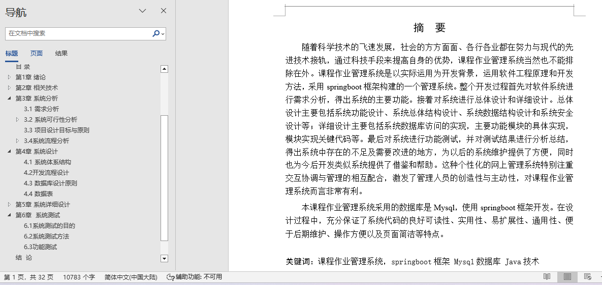
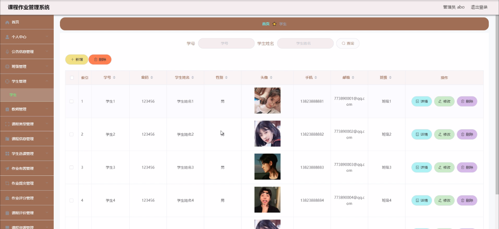
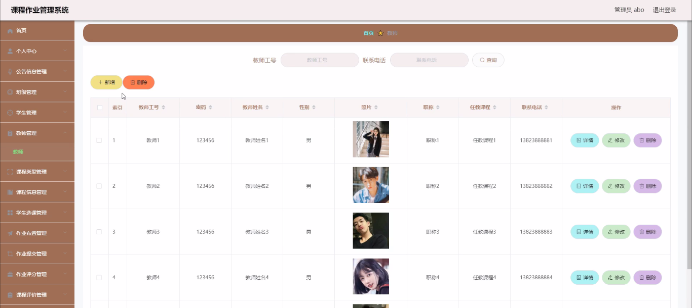
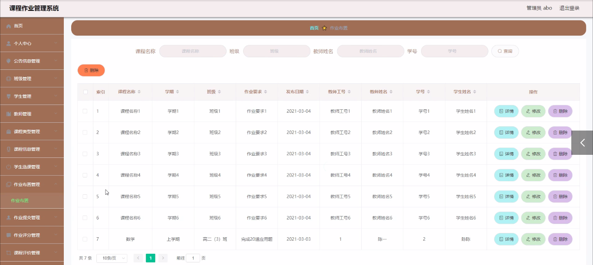
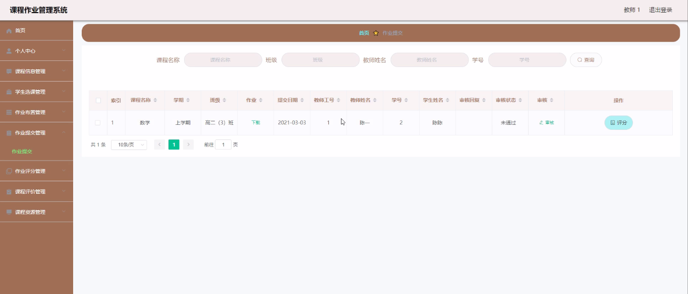
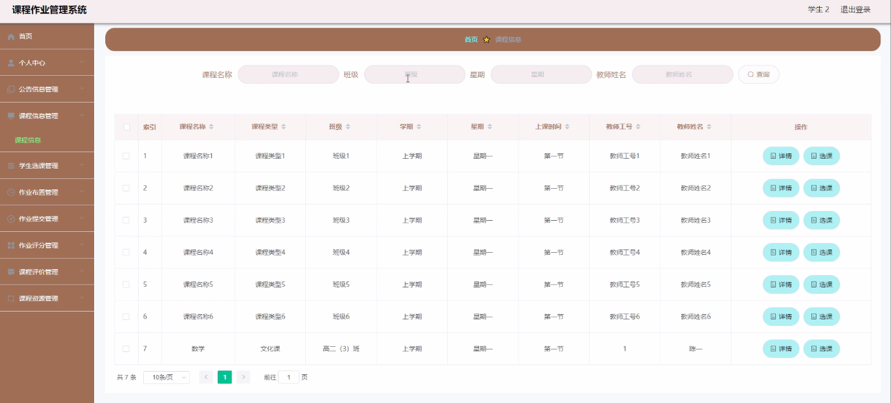
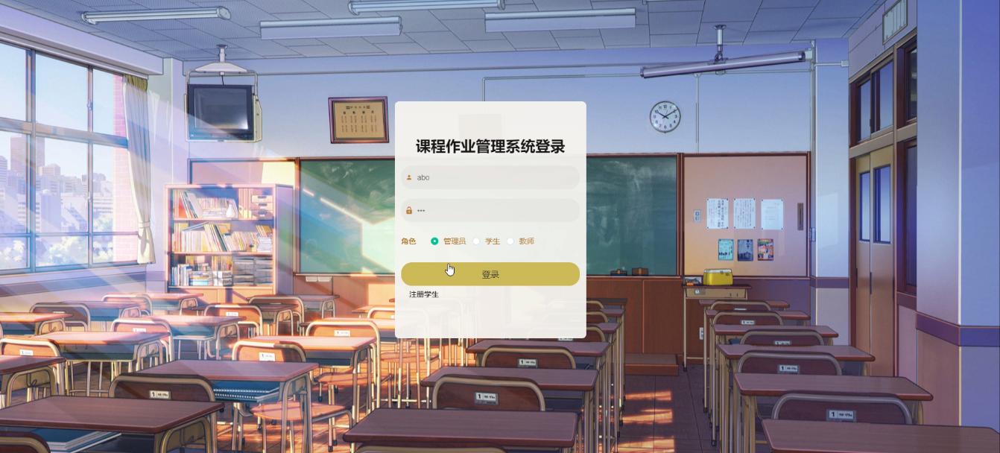

## 基于springboot的课程作业管理系统(程序+报告)

###  获取sql数据库文件: 从戎源码网 (https://armycodes.com/) QQ: 386869957 QQ群: 377586148
###  所有系统地址: (https://github.com/YuLin-Coder/AllProjectCatalog) 
###  所有项目以及源代码本人均调试运行无问题 可支持远程安装部署调试、定制修改、代码讲解

## 项目介绍
基于springboot的课程作业管理系统，系统包含两种角色：用户、管理员，系统分为前台和后台两大模块，主要功能如下：

### 【管理员】:
登录: 管理员通过用户名、密码、角色进行登录。
首页查看: 查看个人中心、公告信息、班级管理、学生管理、教师管理、课程类型、课程信息、学生选课、作业布置、作业提交、作业评分、课程评价、课程资源等信息。
学生管理: 管理员管理学生信息，包括详情查看、修改、删除。
教师管理: 管理员管理教师信息，包括详情查看、修改、删除。
课程信息管理: 查看和管理课程信息，包括课程名称、类型、班级等。
作业布置管理: 查看和管理作业布置信息，包括课程名称、学期、班级等。
作业提交管理: 查看和管理作业提交信息，包括课程名称、学期、班级等。
课程评价管理: 查看和管理课程评价信息，包括课程名称、类型、评分等。

### 【教师】:
登录: 教师通过用户名、密码、角色进行登录。
首页查看: 查看个人中心、课程信息管理、学生选课管理、作业布置管理、作业提交管理、作业评分管理、课程评价管理、课程资源管理等内容。
作业布置管理: 管理作业布置信息，包括修改作业要求等。
作业提交管理: 管理作业提交信息，包括修改或删除作业信息。
课程评价管理: 管理课程评价信息，包括查看、修改、删除评价内容。

### 【学生】:
登录: 学生通过用户名、密码、角色进行登录。
首页查看: 查看个人中心、公告信息、课程信息管理、学生选课管理、作业布置管理、作业提交管理、作业评分管理、课程评价管理、课程资源管理等内容。
个人信息管理: 查看和管理个人信息，包括学号、密码、姓名、性别、手机、邮箱、班级等。
课程信息管理: 查看和管理课程信息，包括课程名称、类型、班级等。
课程评价管理: 管理课程评价信息，包括查看、删除评价内容。
课程资源管理: 查看和管理课程资源信息，包括上传和删除课程附件。

## 项目技术
- 编程语言：Java
- 数据库：MySQL
- 项目管理工具：Maven
- 前端技术：HTML、CSS、JavaScript、Jquery、Vue
- 后端技术：Spring、SpringMVC、MyBatis

## 运行环境
- JDK版本：JDK1.8及以上
- 开发工具：IDEA、Ecplise、Myecplise都可以
- 数据库: MySQL5.7及以上
- Maven：maven3.0及以上
- Node：14.14.0及以上

## 运行截图

